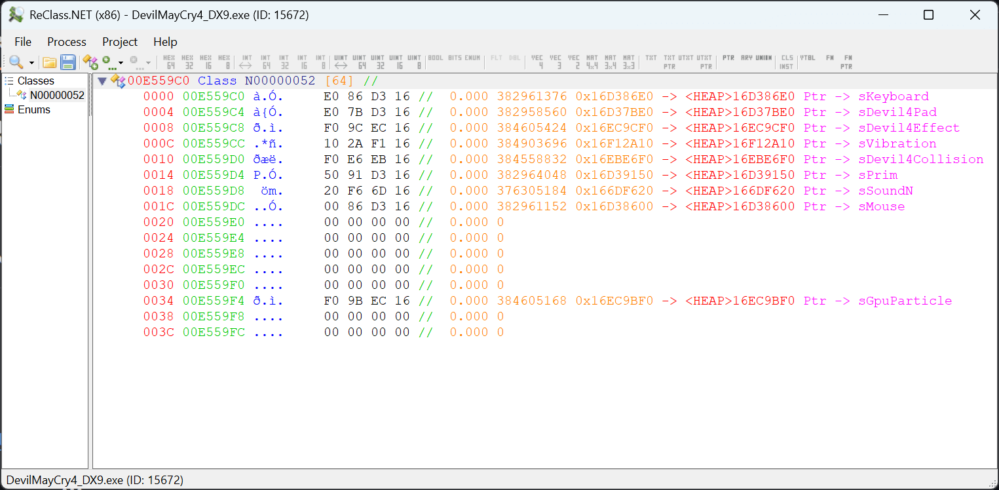

ReClass.NET MtFramework Plugin
=================================

A ReClass.NET plugin which displays type infos of MtFramework classes. Minimal edit from https://github.com/ReClassNET/ReClass.NET-FrostbitePlugin

INSTALLATION
-----
- Download from https://github.com/muhopensores/ReClass.NET-MtFrameworkPlugin/releases
- Copy the dll files in the appropriate Plugin folder (ReClass.NET/x86/Plugins or ReClass.NET/x64/Plugins)
- Start ReClass.NET and check the plugins form.



Compiling
-----
If you want to compile the ReClass.NET MtFramework Plugin just fork the repository and create the following folder structure. If you don't use this structure you need to fix the project references.

```
..\ReClass.NET\
..\ReClass.NET\ReClass.NET\ReClass.NET.csproj
..\ReClass.NET-MtFrameworkPlugin
..\ReClass.NET-MtFrameworkPlugin\FrostbitePlugin.csproj
```
